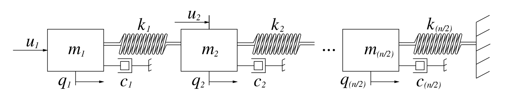

# Gugercin MSD Chain

## Description

This benchmark is a model for a mass-spring-damper chain. It is presented in [Gugercin2012](#References).



The chain consists of ``N = \frac{n}{2}`` masses ``m_1,\,\ldots,\,m_{n/2}`` that are each connected with their neighboring masses by springs with spring constants ``k_1,\,\ldots,\,k_{n/2}``. The last mass ``m_{n/2}`` is connected to a wall via the spring ``k_{n/2}`` while at the first two masses ``m_1`` and ``m_2`` external forces ``u_1(\cdot)`` and ``u_2(\cdot)`` are applied. Moreover, each mass is connected with the ground with a damper with viscosities ``c_1,\,\ldots,\,c_{n/2}``. This configuration leads to a second-order system of the form
```math
M\ddot{q}(t)+C\dot{q}(t)+Kq(t) = B_2u(t),
```
where ``q(t) = \begin{pmatrix} q_1(t),\,\ldots,\,q_{n/2}(t)\end{pmatrix}^\mathsf{T}`` is the vector of displacements of each mass and ``u(t) = \begin{pmatrix} u_1(t),\,u_{2}(t)\end{pmatrix}^\mathsf{T}`` is the vector of inputs. Moreover, 
```math
\begin{aligned}
M &= \begin{bmatrix} m_1 & & & & \\ & m_2 & & & \\ & & m_3 & & \\ & & & \ddots & \\ & & & & m_{n/2} \end{bmatrix}, \quad C = \begin{bmatrix} c_1 & & & & \\ & c_2 & & & \\ & & c_3 & & \\ & & & \ddots & \\ & & & & c_{n/2} \end{bmatrix}, \\
K &= \begin{bmatrix} k_1 & -k_1 & & & \\ -k_1 & k_1 + k_2 & -k_2 & & \\ & -k_2 & k_2+k_3 & \ddots & & \\ & & \ddots & \ddots & -k_{n/2-1} \\ & & & -k_{n/2-1} & k_{n/2-1} + k_{n/2} \end{bmatrix}, \quad B_2 = \begin{bmatrix} 1 & 0 \\
0 & 1 \\ 0 & 0 \\ \vdots & \vdots \\ 0 & 0 \end{bmatrix}.
\end{aligned}
```

The output of the system is chosen as the velocities of the masses which are controlled, i.e.,
```math
y(t) = \begin{pmatrix} \dot{q}_1(t) \\ \dot{q}_2(t)\end{pmatrix}.
```

A linearization leads to the first-order system
```math
\begin{aligned}
\begin{bmatrix} I_n & 0 \\ 0 & M \end{bmatrix} \begin{pmatrix} \dot{x}_1(t) \\ \dot{x}_2(t) \end{pmatrix}  &=
\begin{bmatrix} 0 & I_n \\ -K & -D \end{bmatrix} \begin{pmatrix} x_1(t) \\ x_2(t) \end{pmatrix} + \begin{bmatrix} 0 \\ B_2 \end{bmatrix} u(t), \\
y(t) &= \begin{bmatrix} 0 & B_2^\mathsf{T} \end{bmatrix} \begin{pmatrix} x_1(t) \\ x_2(t) \end{pmatrix},
\end{aligned}
```
where ``x_1(t) := q(t)`` and ``x_2(t) := \dot{q}(t)``. Assume that one uses the momenta instead of velocities, i.e., ``x_2(t) = \dot{q}(t)`` is replaced by
```math
  p(t) := \begin{pmatrix} p_1(t),\,\ldots,\,p_{n/2}(t)\end{pmatrix}^\mathsf{T} := \begin{pmatrix} m_1q_1(t),\,\ldots,\,m_{n/2}q_{n/2}(t)\end{pmatrix}^\mathsf{T}.
```
With this and by appropriate permutations of columns and rows of the system equations one finally obtains the port-Hamiltonian formulation
```math
\begin{aligned}
x(t) &= (J-R) Q x(t) + Bu(t), \\
y(t) &= B^\mathsf{T} Q x(t),
\end{aligned}
```
where
```math
\begin{aligned}
 J &= \begin{bmatrix} 0 & 1 & & & & & \\ -1 & 0 & & & & & \\ & & 0 & 1 & & & \\ & & -1 & 0 & \ddots & & \\ & & & \ddots & \ddots & \ddots & \\  & & & & \ddots & 0 & 1 \\  & & & & & -1 & 0 \end{bmatrix}, \quad 
 R = \begin{bmatrix} 0 & 0 & & & & & \\ 0 & c_1 & & & & & \\ & & 0 & 0 & & & \\ & & 0 & c_2 & \ddots & & \\ & & & \ddots & \ddots & \ddots & \\  & & & & \ddots & 0 & 0 \\  & & & & & 0 & c_{n/2} \end{bmatrix}, \\
 Q &= \begin{bmatrix} k_1 & 0 & k_1 & 0 & & & & \\ 0 & \frac{1}{m_1} & 0 & 0 & & & & \\ -k_1 & 0 & k_1+k_2 & 0 & -k_2 & 0 & & \\ 0 & 0 & 0 & \frac{1}{m_2} & 0 & 0 & & \\ & & & \ddots & \ddots & \ddots & \ddots & \\ & & & & \ddots & \ddots &  \ddots & \ddots \\ &  & & & -k_{n/2-1} & 0 & k_{n/2-1}+k_{n/2} & 0 \\ & & & & 0 & 0 & 0 & \frac{1}{m_{n/2}} \end{bmatrix}, \quad B = \begin{bmatrix} 0 & 0 \\ 1 & 0 \\ 0 & 0 \\ 0 & 1 \\ \vdots & \vdots \\ \vdots & \vdots \\ 0 & 0 \\ 0 & 0 \end{bmatrix},
\end{aligned}
```
and 
```math
 x(t) = \begin{pmatrix} q_1(t),\,p_1(t),\,q_2(t),\,p_2(t),\,\ldots,\,q_{n/2}(t),\,p_{n/2}(t)\end{pmatrix}^\mathsf{T}.
```
## Parameters
This is a variable-dimension model in which ``N = \frac{n}{2} \in \N`` can be determined by the user. We have chosen the parameters (without units)
```math
\begin{aligned}
 m_1 &= \ldots = m_{n/2} = 4, \\
 k_1 &= \ldots = k_{n/2} = 4, \\
 c_1 &= \ldots = c_{n/2} = 1. \\
 N &= 50
\end{aligned}
```
## Interface

To obtain system matrices ``J, R, Q,`` and ``B`` use the following function call.
```julia
using PortHamiltonianBenchmarkSystems
J, R, Q, B = gugercin_pH_msd_chain() # for standard parameters
```

To specify optional arguments, specify the parameters as named arguments.
```julia
using PortHamiltonianBenchmarkSystems
J, R, Q, B = gugercin_pH_msd_chain(n_cells = 150, k_i = 10)
```

The transfer function can be defined as follows.
```julia
using LinearAlgebra, PortHamiltonianBenchmarkSystems
J, R, Q, B = gugercin_pH_msd_chain(n_cells = 150, k_i = 10)
H(s) = B'*((s*I-(J-R)*Q)\B)
```

## Downloads

[](https://github.com/Algopaul/PortHamiltonianBenchmarkSystems/actions/workflows/create_gugercin_msd_systems.yaml)

| MAT                                                                                                                                                      | HDF5                                                                                                                                                    |
| :------------------------------------------------------------------------------------------------------------------------------------------------------: | :-----------------------------------------------------------------------------------------------------------------------------------------------------: |
| [MSD Chain N100](https://nightly.link/Algopaul/PortHamiltonianBenchmarkSystems/workflows/create_gugercin_msd_systems.yaml/main/GugercinN100Mat.zip)      | [MSD Chain N100](https://nightly.link/Algopaul/PortHamiltonianBenchmarkSystems/workflows/create_gugercin_msd_systems.yaml/main/GugercinN100H5.zip)      |
| [MSD Chain N1000](https://nightly.link/Algopaul/PortHamiltonianBenchmarkSystems/workflows/create_gugercin_msd_systems.yaml/main/GugercinN1000Mat.zip)  | [MSD Chain N1000](https://nightly.link/Algopaul/PortHamiltonianBenchmarkSystems/workflows/create_gugercin_msd_systems.yaml/main/GugercinN1000H5.zip) |
| [MSD Chain N20000](https://nightly.link/Algopaul/PortHamiltonianBenchmarkSystems/workflows/create_gugercin_msd_systems.yaml/main/GugercinN20000Mat.zip)  | [MSD Chain N20000](https://nightly.link/Algopaul/PortHamiltonianBenchmarkSystems/workflows/create_gugercin_msd_systems.yaml/main/GugercinN20000H5.zip) |
| [All MSD Chain Models](https://nightly.link/Algopaul/PortHamiltonianBenchmarkSystems/workflows/create_gugercin_msd_systems.yaml/main/AllModelsMat.zip)  | [All MSD Chain Models](https://nightly.link/Algopaul/PortHamiltonianBenchmarkSystems/workflows/create_gugercin_msd_systems.yaml/main/AllModelsH5.zip) |


## References
```LaTeX
@article{Gugercin2012,
	title = {Structure-preserving tangential interpolation for model reduction of port-{Hamiltonian} systems},
	volume = {48},
	number = {9},
	journal = {Automatica J. IFAC},
	author = {Gugercin, S. and Polyuga, R. V. and Beattie, C. and van der Schaft, A.},
	year = {2012},
	pages = {1963--1974},
}
```
