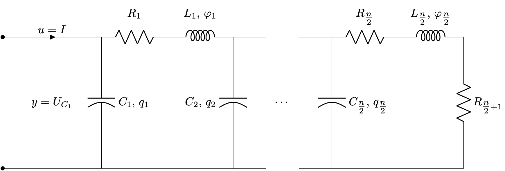

# RCL Ladder Network (ODE)

## Description

This benchmark considers a linear, time-invariant pH-ODE model for electrical ladder networks as described and used for numerical examples in [PS10, GPBS12](@cite). 



The network consists of $N=\tfrac{n}{2}$ cells, where each cell $i=1,\ldots,N$ contains a resistor with resistance $R_i$, capacitor with capacity $C_i$, and inductor with inductance $L_i$. The last cell contains one additional resistor with resistance $R_{\tfrac{n}{2}+1}$. 

The input of the system is chosen as the current $I$ and the output is the voltage over the first capacitor $U_{C_1}$. The state variables are alternating the charge $q_i$ of the capacitors and the flux $\phi_i$ of the inductors, i.e., 
```math
	x(t) = \begin{bmatrix}
		q_1(t), \phi_1(t), \ldots, q_{\tfrac{n}{2}}(t), \phi_{\tfrac{n}{2}}(t)		
	\end{bmatrix} \in \R^{n}.
```

This choice yields the following pH system matrices
```math
	\begin{aligned}
	J &= \begin{bmatrix}
		0 & -1 & 0 & 0\\
		1 & \ddots & \ddots & 0\\
		0 & \ddots & \ddots & -1\\
		0 & 0 & 1 & 0
	\end{bmatrix}, &
	R &= \mathrm{diag}(0, R_1, 0, R_2, \cdots, R_{\tfrac{n}{2}} + R_{\tfrac{n}{2}+1}),\\
	Q &= \mathrm{diag}(C_1^{-1}, L_1^{-1}, C_2^{-1}, L_2^{-1}, \cdots, C_{\tfrac{n}{2}}^{-1}, L_{\tfrac{n}{2}}^{-1}), & 
	G^\top &= \begin{bmatrix}
		1 &
		\cdots &
		0
	\end{bmatrix}.
	\end{aligned}
```

## Parameters
The number of cells $N = \tfrac{n}{2} \in \N$ can be chosen by the user and the input dimension can be set to $m = [1, 2]$. The remaining parameters $R_i$, $C_i$, and $L_i$ can be chosen as positive real numbers.
Following [PS10](@cite), the default parameters are
```math
\begin{aligned}
    N &= 100, \\
    m &= 1, \\
    R_1 &= \ldots = R_{50} = 0.2, \\
    R_{51} &= 0.4, \\
    C_1 &= \ldots = C_{50} = 1, \\
    L_1 &= \ldots = L_{50} = 1. \\
\end{aligned}
```

## Interface

The system matrices can be obtained via the `RCLLadderConfig`.

```@docs
RCLLadderConfig
RCLLadderConfig(::String)
```

In more detail, the system matrices from [PS10](@cite) can be obtained as follows:

```julia
using PortHamiltonianBenchmarkSystems
config = RCLLadderConfig("PS10")
J, R, Q, G = construct_system(config)
```

Alternatively, the parameters can be specified as follows:
```julia
using PortHamiltonianBenchmarkSystems
config = RCLLadderConfig(2, 2, [1, 2, 3], [4, 5], 6)
J, R, Q, G = construct_system(config)
```

!!! note
    The config accepts scalars or vectors for the parameters `R`, `C`, and `L`. If a scalar is provided, it will be applied to all components of the respective type. If a vector is provided, it must have the correct length.


## References
```@bibliography
Pages = ["RCLLadderODE.md"]
Canonical = false
```
