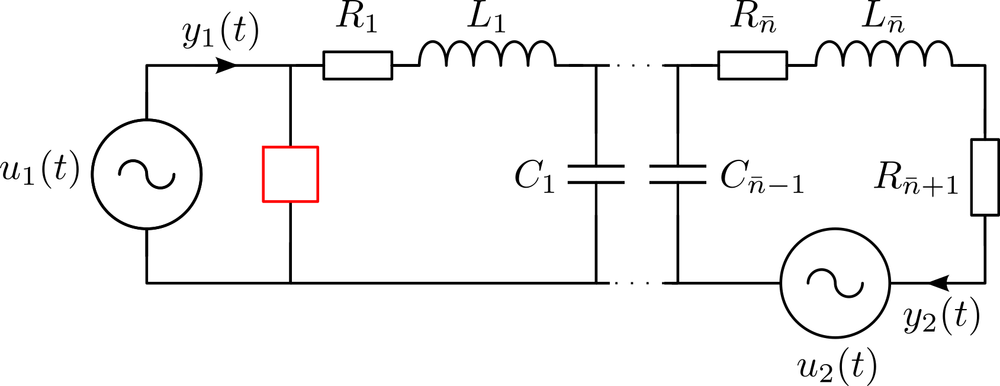

# RCL Ladder Network (DAE)

## Description

This benchmark creates linear, time-invariant pH-DAE models for simple electric circuits consisting of ideal voltage sources, resistors, inductors and capacitors. The modelling of such circuits is described in [Fre11](@cite).



Modeling of such electric circuits with directed graphs leads to systems of the following form:
```math
\begin{aligned}
E \dot{x}(t) &= (J-R)x(t) + Gu(t), \\
y(t) &= G^\mathsf{T} x(t),
\end{aligned}
```
where
```math
\begin{equation*}
	E = \begin{bmatrix} \mathcal{A}_c C \mathcal{A}_c^\mathsf{T} & 0 & 0 \\ 0 & L & 0 \\ 0 & 0 & 0 \end{bmatrix}, \, J = \begin{bmatrix} 0 & -\mathcal{A}_l & -\mathcal{A}_v \\ \mathcal{A}_l^\mathsf{T} & 0 & 0 \\ \mathcal{A}_v^\mathsf{T} & 0 & 0 \end{bmatrix},\, R = \begin{bmatrix} \mathcal{A}_r R^{-1}\mathcal{A}_r^{\mathsf{T}} & 0 & 0 \\ 0 & 0 & 0 \\ 0 & 0 & 0 \end{bmatrix},\, G = \begin{bmatrix} 0 \\ 0 \\ -I_m \end{bmatrix}.	
\end{equation*}
```
Here, the matrices ``R,\,L,\,C`` are positive definite diagonal matrices that contain the resistances, inductances and capacitances, respectively, as entries. The incidence matrices ``\mathcal{A}_r,\,\mathcal{A}_l,\,\mathcal{A}_c,\,\mathcal{A}_v`` follow directly from the directed graph of the network and contain only entries in ``\{-1,0,1\}``. The inputs ``u(t)`` of the system are the voltages ``v_v(t)`` provided by the voltage sources and the outputs are the negative currents ``i_v(t)`` through the voltage sources. The state vector is given by ``x(t) := \begin{bmatrix}	v(t)^\mathsf{T} & i_l(t)^\mathsf{T} & i_v(t)^\mathsf{T} \end{bmatrix}^\mathsf{T}`` with node voltages ``v(t)`` and inductor currents ``i_l(t)``. Consequently, the dimension of the
model is given by ``n = 3\widetilde{n} + 2m``, where ``\widetilde{n}`` denotes the number of loops in the system and ``m`` is the number
of voltage sources. Since ``\mathcal{A}_c C \mathcal{A}_c^\mathsf{T}`` is diagonal for the circuit in Figure 1, a transformation of the model to semi-explicit form is straightforward.
The benchmark allows for different configurations of the network that will change the index of the resulting pH-DAE model and its number of inputs and outputs. 

1. SISO/MIMO: In the multiple-input multiple-output (MIMO) version, the inputs are the voltages of both voltage sources and the outputs are the currents as shown in Figure 1. In the single-input single-output (SISO) configuration, we replace the second voltage source by a wire and only consider the input-to-output behaviour from ``u_1(\cdot)`` to ``y_1(\cdot)``.
2. Index 1/Index 2: The differentiation index of the system depends on the electrical component that is placed at the position of the red box in Figure 1. A resistor leads to pH-DAEs with index 1 and a capacitor is used in the index 2 case which leads to improper transfer functions.

## Parameters
The topology of the network and its characteristics may be changed via
1. The values for the resistances ``r``, capacitances ``c`` and inductances ``l``. If scalars are provided, the value will be applied to all components of the respective type. Parameters can be supplied to each component separately by providing vectors of suitable length.
2. The number ``\widetilde{n}`` of loops in the network.
3. The number of inputs (voltage sources) ``m``.

## Interface

To obtain system matrices ``E, J, R`` and ``G`` use the following function call.
```julia
using PortHamiltonianBenchmarkSystems
E, J, R, Q, G = setup_DAE1_RCL_LadderNetwork_sparse() # for standard parameters
```

To specify optional arguments, specify the parameters as named arguments.
```julia
using PortHamiltonianBenchmarkSystems
E, J, R, Q, G = setup_DAE1_RCL_LadderNetwork_sparse(ns = 500, r = rand(502))
```

The transfer function can be defined as follows.
```julia
using LinearAlgebra, PortHamiltonianBenchmarkSystems
E, J, R, G = setup_DAE1_RCL_LadderNetwork_sparse()
H(s) = G'*((s*E-(J-R))\G)
```

```@docs
setup_DAE1_RCL_LadderNetwork_sparse()
setup_DAE2_RCL_LadderNetwork_sparse()
```

## References
```@bibliography
Pages = ["RclCircuits.md"]
Canonical = false
```
